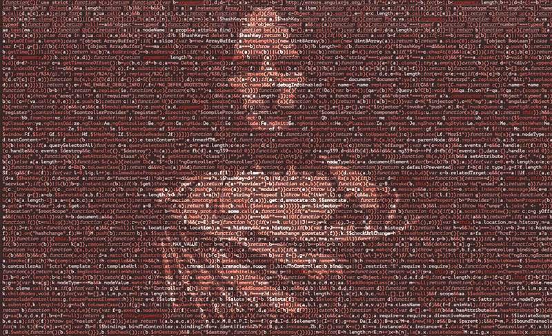

# Programming the Past

**HIS4936** *Programming the Past* 
[University of South Florida](http://www.usf.edu/)

Instructor: [David J. Thomas](mailto::davidjthomas@usf.edu), [thePortus.com](http://thePortus.com/)

---

---

Learn the skills to conduct digitally driven research in the social sciences and humanities. This course assumes extensive prior technological experience, aside from taking [Hacking History](https://hacking-history.readthedocs.io). Discover previously untapped sources of information, use time-saving tools, and visualize your arguments. Digital scholarship allows you to understand your own fields more completely and ask questions of your evidence that was previously unthinkable.

Above all, this course will teach you how to start a historically-based digital research project from scratch. You will learn how to model historical actors and objects, create databases, and query information from them. As a final product, you will publish an online workbook discussing your process and initial conclusions. You will also publish the SQL and data you create so that others may replicate your database.

As tools become more popular and accessible, digital scholarship is one of the fastest growing areas of research. At the same time, there have been misapplications. We will explore how to think critically about the appropriate application of digital methods, asking: what can data really teach us?
